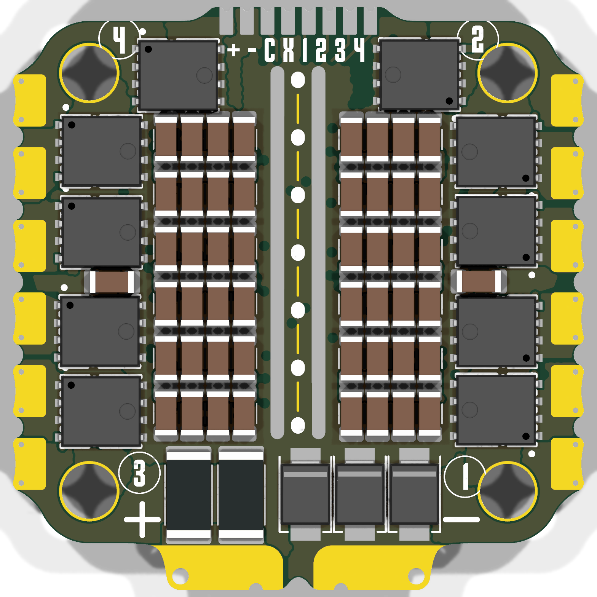
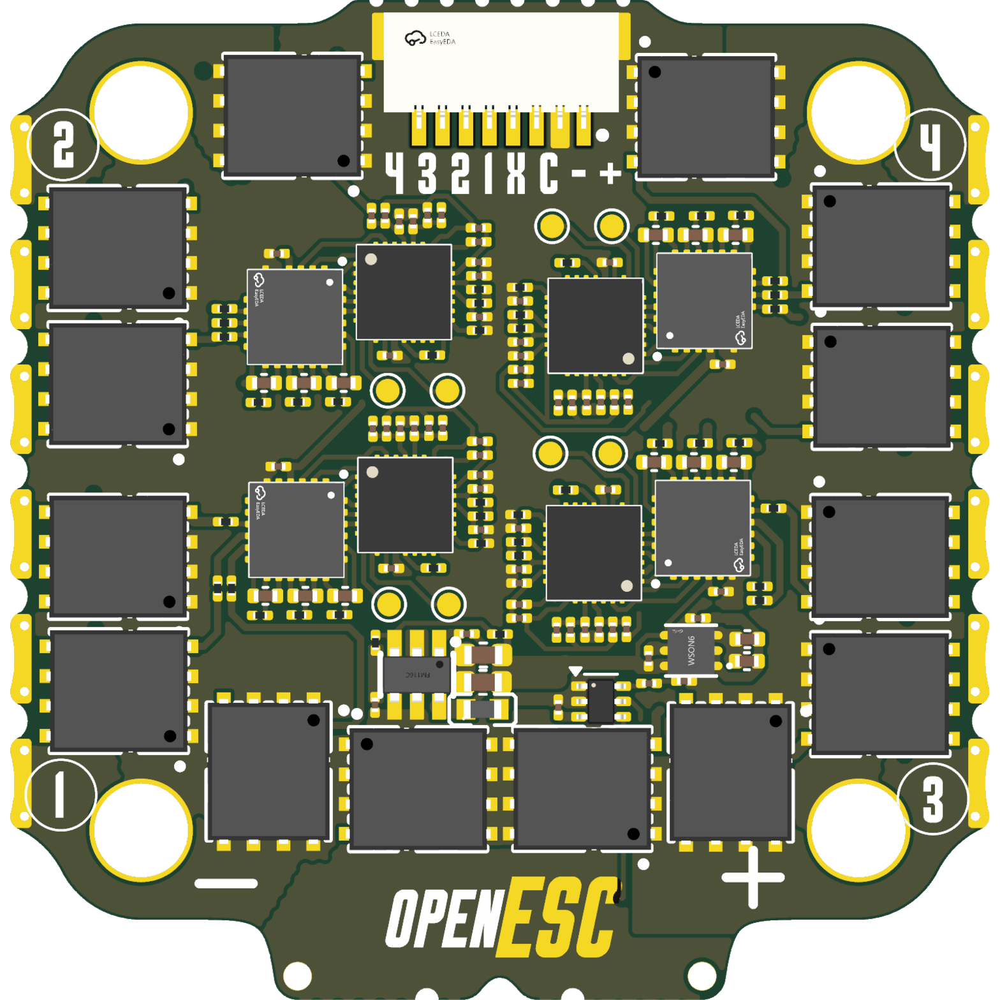

# OpenESC-30x30

Open-source 4-in-1 BLDC ESC with a 30.5 × 30.5 mm mounting pattern, built around four independent AT32F421 motor controllers running AM32. Six-layer, DShot over the standard 8-pin connector. Designed in KiCad for JLCPCB assembly.

 

Part of the incutec OpenDrone line (`incutec-hw/OpenESC-30x30`).

> A smaller **[OpenESC_20X20](https://github.com/incutec-hw/OpenESC_20X20)** (20×20 mm) shares this design and mirrors this repo. The two differ only in board/mounting size and a few power-stage parts.
>
> 📖 This README is the canonical board reference. Per-sheet engineering rationale (mirrored from the on-canvas KiCad comments) is in [`DESIGN_NOTES.md`](DESIGN_NOTES.md). Build, flashing, and bring-up/testing notes belong in the project wiki.

## Architecture

Four fully independent ESC channels share a common power input and telemetry connector. Each channel has its own MCU and gate driver; the high-current stage is six MOSFETs per channel (three half-bridges). This is the distributed-MCU AM32 4-in-1 topology rather than a single-MCU design. Values below are extracted from the KiCad design files (`4in1.kicad_sch`, `ESC.kicad_sch`, `4in1.kicad_pcb`) and the production BOM (`production/Rev1-30x30_bom.csv`).

| Block | Part | LCSC | Per board |
|---|---|---|---|
| Motor MCU | AT32F421G8U7 (QFN-28) | C2765098 | 4 |
| Gate driver | NSG2065Q (QFN-24) | C41414478 | 4 |
| Power MOSFETs | SP40N01GHNK PDFN-8L (5×6) | C22385416 | 24 (6 per channel) |

## Specifications

| Parameter | Value |
|---|---|
| Channels | 4 independent BLDC channels |
| MCU | AT32F421G8U7 (ARM Cortex-M4, QFN-28), one per channel |
| Gate driver | NSG2065Q (QFN-24, FD6288Q-compatible), one per channel |
| Power MOSFETs | SP40N01GHNK, N-channel, PDFN-8L (5×6), 24 total (XRS280N03C selected as drop-in next-gen — not yet swapped) |
| Current sense | Board-level high-side: INA186A3IDCKR (100 V/V, SC-70-6) across 2× 0.2 mΩ 2512 shunts in parallel (0.1 mΩ) in the +BATT feed → 10 mV/A → ~330 A full-scale at 3.3 V ADC |
| Input | +BATT direct from connector/pads, 3S–6S |
| Input protection | 3× SMBJ24A TVS (24 V standoff) |
| Buck regulator | LMR54406DBVR (SOT-23-6) + FTC160808S4R7MBCA 4.7 µH inductor → +10 V gate-drive rail (FB 115k/10k, Vref 0.8 V → 10.0 V) |
| LDO | TLV76733DRVR (WSON-6) → +3V3 (MCUs, sensing), from +10 V |
| Signal protocol | DShot (4 independent signal lines, one per channel) |
| Firmware | AM32 (per-channel AT32F421 target, flashed individually) |
| PCB | 6-layer, 1.69 mm |
| Mounting pattern | 30.5 × 30.5 mm, 4× Ø4.0 mm holes (M3) |

Current/voltage ratings are not printed on the design files. The input clamp is set by the SMBJ24A TVS (24 V standoff → 3S–6S); the MOSFET (SP40N01GHNK) and current-sense full-scale (~330 A) set the practical envelope. Characterize before quoting a hard rating.

## Connector

8-pin JST **SM08B-SRSS-TB** (J1). Pin-to-net mapping extracted from the schematic (net labels at the connector pins):

| Pin | Net | Function |
|---|---|---|
| 1 | +BATT | Battery positive |
| 2 | GND | Ground |
| 3 | /CURR | Current-sense telemetry (INA186 output) |
| 4 | *(unconnected)* | No dedicated telemetry pin — telemetry handled by extended DShot |
| 5 | /M1 | DShot signal, channel 1 |
| 6 | /M2 | DShot signal, channel 2 |
| 7 | /M3 | DShot signal, channel 3 |
| 8 | /M4 | DShot signal, channel 4 |

Connector ground returns on the shield/mounting pads P1/P2 (both GND). The same eight signals are also broken out as direct solder pads (U3). Pin 4 — the dedicated telemetry pin on the Betaflight 8-pin standard — is intentionally unconnected: ESC→FC telemetry is carried over the motor signal lines via the bidirectional **extended DShot** protocol.

## Variants and revisions

| File | Description |
|---|---|
| `4in1.kicad_pro` / `.kicad_pcb` / `.kicad_sch` | Main design (30×30). |
| `4in1-panel.kicad_pro` / `.kicad_pcb` | Panelized version for production fabrication. |

This repo is the 30×30 member of the OpenESC family; the 20×20 sibling lives in [`OpenESC_20X20`](https://github.com/incutec-hw/OpenESC_20X20). Production exports in `production/` are versioned `V0.1`–`V0.4` and `Rev1`. `Rev1-30x30` is the 30×30-only fabrication set; `Rev1-30x3020x20` is a combined shared-fab set produced alongside the mini.

## Firmware

[AM32](https://github.com/AlkaMotors/AM32-MultiRotor-ESC-firmware) — incutec's default ESC firmware. Each channel's AT32F421G8U7 is flashed independently (SWD/SWC). The AT32F421 + NSG2065Q per-channel topology and the DShot signal nets are the standard AM32 4-in-1 hardware target. Works with Betaflight and other DShot-capable flight controllers.

## Repository structure

```
4in1.kicad_sch              Top schematic (power, current sense, connector)
ESC.kicad_sch               Single ESC channel sheet (instantiated 4×)
4in1.kicad_pcb              Main board layout (6-layer)
4in1.kicad_pro              Main project
4in1-panel.kicad_pcb        Panelized layout for production
4in1-panel.kicad_pro        Panel project
components.kicad_sym        Project-local symbol library
4in1ESC-30x30.pretty/       Project-local footprints
4in1ESC-30x30.3dshapes/     3D models (STEP)
4in1.step / 4in1.glb        Exported board 3D models
production/                 JLCPCB fabrication exports (gerbers, BOM, CPL) per revision
licensing/                  Hardware license, third-party notices, trademark policy
cost-analysis.md            JLCPCB 500-unit cost breakdown (note: predates latest BOM)
database/                   Component analysis notes
images/                     Render images
```

## Manufacturing

Targets JLCPCB PCBA. Each `production/<rev>.zip` contains gerbers; `_bom.csv`, `_designators.csv`, and `_positions.csv` are the assembly inputs. Latest single-board set: `production/Rev1-30x30.*`. Fabrication exports are generated with the KiCad Fabrication Toolkit (`fabrication-toolkit-options.json`).

Note: in both the schematic symbol and the production BOM, the MOSFET's Value and LCSC fields are swapped (Value carries the LCSC code `C22385416`, the LCSC column carries the MPN `SP40N01GHNK`). The assembled part is **SP40N01GHNK / C22385416** (24×); the field swap is a metadata cleanup item, not a circuit change.

## License

Hardware: [CERN-OHL-S-2.0](https://ohwr.org/cern_ohl_s_v2.txt). See [LICENSE](LICENSE), [licensing/THIRD_PARTY.md](licensing/THIRD_PARTY.md), and [licensing/TRADEMARKS.md](licensing/TRADEMARKS.md). Some bundled 3D model assets carry their own upstream notices (CC-BY-SA-4.0 / GPL).
